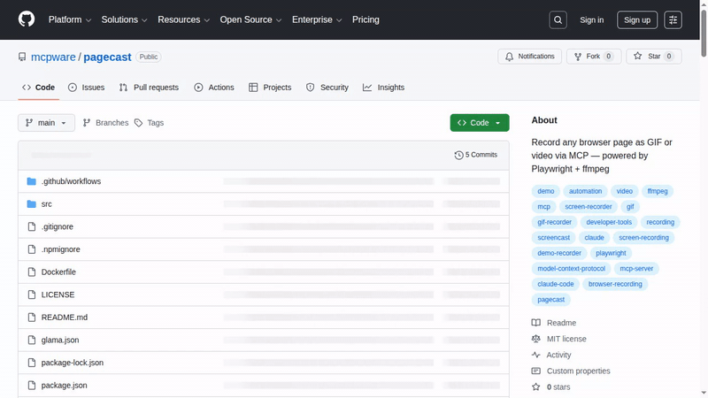

# Pagecast

[](https://www.npmjs.com/package/@mcpware/pagecast)
[](LICENSE)
[](https://github.com/mcpware/pagecast)
[](https://github.com/mcpware/pagecast/fork)

> Record any browser page as GIF or video via MCP — powered by Playwright + ffmpeg.

AI assistants can record browser sessions, perform interactions (scroll, click, hover), and export optimized GIFs or video — perfect for demo content, documentation, and recording automated workflows.



## The Problem

Creating demo GIFs and recording browser sessions is manual and tedious:
1. Open a screen recorder
2. Manually perform the demo
3. Export and optimize the GIF
4. Repeat when the UI changes

**Pagecast** lets AI assistants do this programmatically. Record what the browser does, export as GIF or video.

## How It Works

```
AI Assistant → MCP tools → Playwright (browser + video recording)
                                ↓
                         .webm video file
                                ↓
                    ffmpeg two-pass palette → optimized .gif
```

1. `record_page` opens a URL in Chromium with video recording enabled
2. `interact_page` scrolls, clicks, hovers — all captured in the recording
3. `stop_recording` saves the .webm file
4. `convert_to_gif` creates an optimized GIF using ffmpeg's two-pass palette method

## Tools

| Tool | Description |
|------|-------------|
| `record_page` | Open URL and start recording. Returns session ID |
| `interact_page` | Perform actions during recording (scroll, click, hover, wait, navigate) |
| `stop_recording` | Stop recording and save .webm file |
| `convert_to_gif` | Convert .webm to optimized GIF (two-pass palette, trim blank frames) |
| `record_and_gif` | All-in-one: record URL for N seconds → GIF |
| `list_recordings` | List all recordings in output directory |

## Quick Start

### Prerequisites

- Node.js ≥ 20
- ffmpeg (`sudo apt install ffmpeg` / `brew install ffmpeg`)
- Chromium (auto-installed with Playwright)

### Add to Claude Code

```bash
claude mcp add pagecast -- npx -y @mcpware/pagecast
```

### Or run directly

```bash
npx @mcpware/pagecast
```

### Headless mode (no visible browser window)

```bash
claude mcp add pagecast -- npx -y @mcpware/pagecast --headless
```

By default, Pagecast opens a **visible browser window** so you can see what's being recorded. Use `--headless` for background recording.

### Install Playwright browsers (first time only)

```bash
npx playwright install chromium
```

## Use Cases

| Use Case | Duration | Output | Example Prompt |
|----------|----------|--------|---------------|
| **Demo GIF for README** | 5-15s | GIF | "Record my app, click through the main features, make a GIF" |
| **Record automation session** | 1-5min | WebM/MP4 | "Log into the dashboard, toggle settings, record the whole thing" |
| **QA / test evidence** | 30s-2min | MP4 | "Run through the checkout flow and record it as evidence" |
| **Record form submission** | 15-60s | GIF or MP4 | "Fill out the signup form with test data and record the process" |
| **Document a bug** | 10-30s | GIF | "Go to the settings page, click export — record what happens" |
| **Onboarding walkthrough** | 1-3min | WebM | "Walk through the first-time user flow and record a video" |

## Usage Examples

### Simple: Record a page for 5 seconds

Ask your AI assistant:
> "Record https://myapp.localhost:3000 for 5 seconds and make a GIF"

The assistant calls `record_and_gif` → outputs `recordings/recording-{id}.gif`

### Demo GIF with interactions

> "Record my app at localhost:3000. Scroll down slowly, hover over the navbar, then stop and make a GIF"

1. `record_page` → starts recording
2. `interact_page` → scrolls, hovers (all captured on video)
3. `stop_recording` → saves .webm
4. `convert_to_gif` → optimized GIF for README

### Record a full automation session

> "Log into the dashboard, navigate to settings, toggle dark mode, and record the whole thing"

1. `record_page` → opens the page and starts recording
2. `interact_page` → clicks through the UI (multiple action sequences)
3. `stop_recording` → saves the full session as .webm
4. Keep as video for review, or `convert_to_gif` for a short clip

### QA evidence capture

> "Go to the payments page, try submitting an empty form, and record what error messages appear"

1. `record_page` → starts recording
2. `interact_page` → navigates, clicks submit, waits for errors
3. `stop_recording` → saves as evidence .webm

## Comparison

| Approach | Automated? | Interactions? | Output | AI-driven? |
|----------|-----------|--------------|--------|-----------|
| **Pagecast** | ✅ | ✅ scroll/click/hover | GIF + WebM | ✅ |
| gifcap.dev | ❌ manual | ❌ manual | GIF | ❌ |
| Peek / ScreenToGif / Kap | ❌ manual | ❌ manual | GIF | ❌ |
| Playwright MCP (official) | ✅ | ✅ | Screenshot only | Partial |
| playwright-record-mcp | ✅ | ✅ | WebM only | Partial |
| VHS (Charmbracelet) | ✅ | Terminal only | GIF | ❌ |

## GIF Quality

Uses ffmpeg's **two-pass palette method** for optimal quality:

1. **Pass 1**: Analyzes all frames to build an optimal 256-color palette (`palettegen=stats_mode=diff`)
2. **Pass 2**: Encodes GIF using that palette with Bayer dithering (`paletteuse=dither=bayer`)

This produces dramatically better quality than single-pass encoding at similar file sizes.

## Configuration

| Environment Variable | Default | Description |
|---------------------|---------|-------------|
| `RECORDING_OUTPUT_DIR` | `./recordings` | Where to save recordings |

| CLI Flag | Default | Description |
|----------|---------|-------------|
| `--headless` | off (headed) | Run browser without visible window |

### GIF defaults

| Setting | Default | Notes |
|---------|---------|-------|
| FPS | 10 | Higher = smoother but larger |
| Width | 640px | Height auto-scaled. Half of 1280px viewport |
| Video viewport | 1280×720 | Full HD recording, downscaled for GIF |

## Architecture

```
src/
├── index.js       # MCP server — 6 tool definitions, stdio transport
├── recorder.js    # Playwright browser lifecycle + session management
└── converter.js   # ffmpeg two-pass GIF conversion
```

**Key design decisions:**

- **Headed by default** — You see what the browser is doing. Use `--headless` for background recording
- **Lazy browser launch** — Chromium only starts on first `record_page` call, keeping MCP server startup fast
- **Session-based** — Multiple recordings can run simultaneously, tracked by session ID
- **One browser, multiple contexts** — Each recording gets its own BrowserContext (lightweight, isolated)
- **`execFile` not `exec`** — No shell interpretation of filenames for safety

## License

MIT
