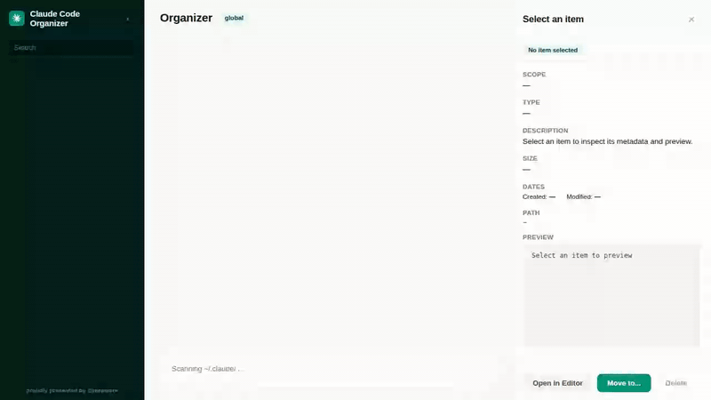

# Pagecast

[](https://www.npmjs.com/package/@mcpware/pagecast)
[](https://www.npmjs.com/package/@mcpware/pagecast)
[](LICENSE)
[](https://github.com/mcpware/pagecast)
[](https://github.com/mcpware/pagecast/fork)

**English** | [廣東話](README.zh-HK.md)

**Turn AI browser interactions into polished product demos.**

Tell your AI to demo your app. Pagecast records the browser, tracks every click and keystroke, and exports a shipping-ready GIF or MP4 — with tooltip zoom overlays and cinematic pan effects. No screen recorder. No video editor. No post-production.

### Without Pagecast — plain screen recording. You can see the cursor moving, but the actual interactions are too small to follow:



### With Pagecast (tooltip mode) — a magnified close-up appears on every interaction so viewers can actually see what's happening:


### With Pagecast (cinematic mode) — the camera crops and pans to follow each action:


## Two ways to use Pagecast

### 1. Product demo tool (the main use case)

You built a web app. You need a demo GIF for the README. Normally you'd:

1. Open a screen recorder, manually click through the demo
2. Open a video editor, zoom into the important parts
3. Export, figure out ffmpeg, optimize the file size
4. UI changes → repeat everything

**With Pagecast**, you tell your AI:

```
"Record a demo of localhost:3000 for my GitHub README"
```

The AI opens a real browser, interacts with your app, and exports a polished GIF with auto-zoom on every interaction. UI changes? Just re-run. The demo rebuilds itself.

### 2. Screen recording tool (also works)

Don't need zoom effects? Pagecast works as a plain screen recorder too:

```
"Record my app for 10 seconds and export as MP4"
```

The AI records, you get a `.webm` → optimized `.gif` or `.mp4`. Two-pass ffmpeg palette optimization, platform-aware sizing, one tool call.

## Export Modes

| Mode | Tool | What it does | Best for |
|------|------|---|---|
| **Tooltip** | `smart_export` | Full viewport visible + magnified tooltip inset near each interaction | README demos, product pages |
| **Cinematic** | `cinematic_export` | Camera crops and pans to follow each interaction | Social media, dramatic reveals |
| **Plain** | `convert_to_gif` / `convert_to_mp4` | Standard screen recording, no zoom effects | Bug reports, QA captures |

## Just Say Where It's Going

You don't need to know viewport sizes or formats. Just tell your AI the destination:

```
"Record a demo for GitHub README"           → 1280×720 GIF
"Record my app for Instagram Reels"         → 1080×1920 MP4
"Make a TikTok demo of my dashboard"        → 1080×1920 MP4
"Record for YouTube"                        → 1280×720 MP4
```

| Platform | Size | Format | Aspect |
|----------|------|--------|--------|
| `github` / `readme` | 1280×720 | GIF | 16:9 |
| `youtube` / `twitter` | 1280×720 | MP4 | 16:9 |
| `reels` / `tiktok` / `shorts` | 1080×1920 | MP4 | 9:16 |
| `instagram` / `linkedin` | 1080×1080 | MP4 | 1:1 |
| Custom | Any size | Your choice | Any |

## Quick Start

**Node.js ≥ 20** and **ffmpeg** required.

```bash
# Add to Claude Code
claude mcp add pagecast -- npx -y @mcpware/pagecast

# Or run directly
npx @mcpware/pagecast

# Headless mode (no visible browser)
claude mcp add pagecast -- npx -y @mcpware/pagecast --headless

# First time: install browser
npx playwright install chromium
```

## How It Works

```
You: "Record a demo of my app"
            ↓
AI → record_page(url, platform: "github")
    Opens Chromium (visible) at 1280×720
    Injects cursor highlight + click ripple
            ↓
AI → interact_page(click, type, hover...)
    Each action records bounding box + timestamp
            ↓
AI → stop_recording
    Saves .webm + timeline.json
            ↓
AI → smart_export (tooltip mode)
        or cinematic_export (crop-pan mode)
        or convert_to_gif (plain mode)
            ↓
    Shipping-ready .gif or .mp4
```

**What makes the demo look professional:**
- **Cursor highlight** — red dot tracks the mouse so viewers can follow the action
- **Click ripple** — visual feedback on every click
- **Tooltip overlay** — magnified close-up appears near each interaction, with a small arrow pointing toward it
- **Cinematic pan** — smooth crop transitions between interaction targets with easeInOut curves

## MCP Tools

| Tool | What it does |
|------|---|
| `record_page` | Open a URL, start recording. Auto-injects cursor highlight + click ripple |
| `interact_page` | scroll, click, hover, type, press keys, select, navigate, waitForSelector — all captured with bounding boxes |
| `stop_recording` | Stop and save `.webm` + `-timeline.json` (event timeline with interaction positions) |
| `smart_export` | **Tooltip overlay** — magnified tooltip close-up on each interaction |
| `cinematic_export` | **Cinematic crop-pan** — camera follows the action between interaction targets |
| `convert_to_gif` | WebM → optimized GIF (ffmpeg two-pass palette, configurable FPS/width/trim) |
| `convert_to_mp4` | WebM → MP4 (H.264, ready for social/sharing/embedding) |
| `record_and_export` | All-in-one: record → auto-export to GIF or MP4 based on platform |
| `list_recordings` | List all `.webm`, `.gif`, and `.mp4` files in output directory |

## Comparison

| | Automated | Interactions | Demo zoom | Output | AI-driven | Platform presets |
|---|:-:|:-:|:-:|---|:-:|:-:|
| **Pagecast** | ✅ | ✅ click/type/scroll/hover | ✅ tooltip + cinematic | **GIF + WebM + MP4** | ✅ | ✅ |
| Screen Studio | ❌ manual | ❌ | ✅ cursor-based | MP4 | ❌ | ❌ |
| AutoZoom | ❌ manual | ❌ | ✅ click-based | MP4 | ❌ | ❌ |
| Playwright MCP | ✅ | ✅ | ❌ | Raw `.webm` | Partial | ❌ |
| gifcap.dev / Peek / Kap | ❌ manual | ❌ | ❌ | GIF | ❌ | ❌ |
| VHS (Charmbracelet) | ✅ scripted | Terminal only | ❌ | GIF | ❌ | ❌ |

**Screen Studio and AutoZoom have great zoom — but require manual recording.** Pagecast is the only tool where the AI records AND the demo effects are automatic.

## Configuration

| Setting | Default | Notes |
|---------|---------|-------|
| Browser | **Headed** (visible) | `--headless` for background |
| GIF FPS | 12 | Higher = smoother, larger |
| GIF width | 800px | Height auto-scaled |
| Tooltip magnify | 1.6x | How much the tooltip zooms in |
| Tooltip size | 380px | Size of the tooltip inset |
| Cinematic zoom | 2.5x | How much the camera zooms in |
| Zoom transition | 0.35s | Smoothstep ease-in/out duration |
| Cursor overlay | On | Red dot + click ripple effect |
| Video viewport | 1280×720 | Or use `platform` parameter |
| Output dir | `./recordings` | Override: `RECORDING_OUTPUT_DIR` |

## Architecture

```
src/
├── index.js        # MCP server — 9 tools, platform presets, stdio transport
├── recorder.js     # Playwright browser lifecycle + sessions + event timeline
├── converter.js    # ffmpeg GIF/MP4 + tooltip overlay + cinematic zoom conversion
├── zoom.js         # Zoom engine — chains, panning, tooltip events, FFmpeg expressions
├── tooltip.js      # Tooltip PNG generator (rounded rect + arrow, pure Node.js)
└── remotion/
    ├── ZoomComposition.jsx  # React composition for cinematic zoom
    ├── Root.jsx             # Remotion entry point
    └── render.js            # Remotion CLI wrapper
```

- **Event timeline** — every interaction records bounding box + timestamp
- **Cursor overlay** — red dot + click ripple injected into the page
- **Tooltip overlay** — magnified close-up in a clean tooltip frame with directional arrow
- **Cinematic zoom chains** — nearby interactions form chains that zoom in, pan, zoom out
- **Thread-safe FFmpeg expressions** — crop filters work correctly with multi-threaded encoding
- **Headed by default** — watch what the AI does
- **`execFile` not `exec`** — safe against shell injection

## More from @mcpware

| Project | What it does | Install |
|---------|---|---|
| **[Instagram MCP](https://github.com/mcpware/instagram-mcp)** | 23 Instagram Graph API tools — posts, comments, DMs, stories, analytics | `npx @mcpware/instagram-mcp` |
| **[Claude Code Organizer](https://github.com/mcpware/claude-code-organizer)** | Visual dashboard for Claude Code memories, skills, MCP servers, hooks | `npx @mcpware/claude-code-organizer` |
| **[UI Annotator](https://github.com/mcpware/ui-annotator-mcp)** | Hover labels on any web page — AI references elements by name | `npx @mcpware/ui-annotator` |
| **[LogoLoom](https://github.com/mcpware/logoloom)** | AI logo design → SVG → full brand kit export | `npx @mcpware/logoloom` |

## License

MIT
